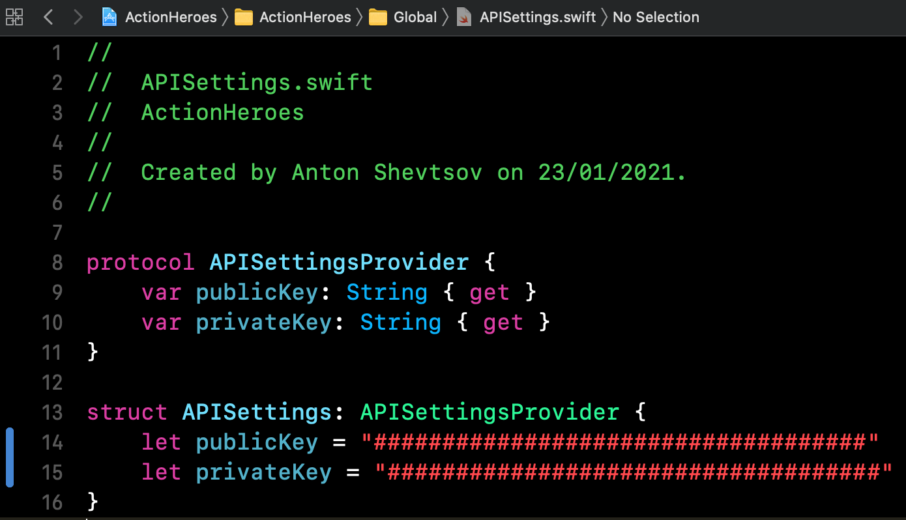

# Action Heroes

## Target environment
- Xcode 12.3
- Swift 5
- iOS 14

## Project highlights
- Swift UI 2
- Combine FRP
- MVVM with UI bindings
- Persistence layer for hired heroes storage
- Logic separation
- Dependency injection
- App coordination
- Error toasts for network issues
- Photo parallax effect (sticky header) in hero details screen
- Custom confirmation modal on "fire a hero" action instead of alert
- Unit tests

## 3rd party libraries used
- API wrapper around Alamofire using Combine
- Kingfisher for lazy loading images and caching in SwiftUI

### What could be improved given more time
- better API error handling with retry and empty state
- replace system activity indicator (deprecated style in iOS14)
- replace many different unavailable hero images from API to a common consistant good looking one
- more unit and ui tests
- accessibility and light/dark mode support

#### Instructions
You'll need Marvel API keys to build and run this project.
Please paste your keys in the APISettings.swift as on picture below.

